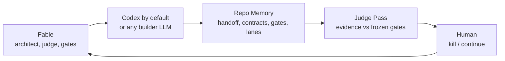
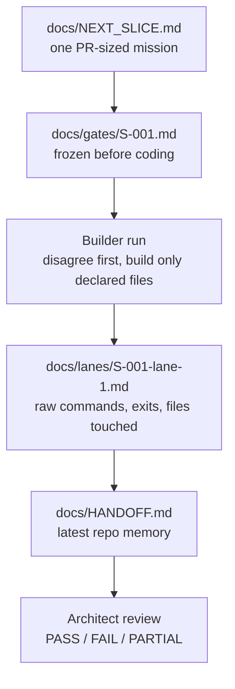

# JudgeLoop

> **Fable decides. Codex builds by default. Repo stores proof. Human judges.**

JudgeLoop is a repo-local evidence protocol for AI-built software.

It stops the builder model from grading itself.

Fable decides.
Codex builds.
Repo stores proof.
Human judges.

Use Fable as the architect and judge. Use GPT-5.5 Codex as the default builder.
Freeze the gates before coding. Make the builder report raw evidence.

Other LLMs can replace the builder. The key rule is that the builder does not
grade itself.

Codex, Opus, GLM, Kimi, DeepSeek, Qwen, or any other LLM can fill the builder
role as long as it can edit files, run checks, or produce patches with raw
evidence back to the repo.

[](https://github.com/jumperz11/judge-loop)
[](LICENSE)



The point is simple: do not spend frontier-model time on typing. Spend it on
deciding what deserves to be typed.

---

## 30-Second Version

```bash
git clone https://github.com/jumperz11/judge-loop
cd your-project
python3 /path/to/judge-loop/scripts/init.py .
# fill docs/NEXT_SLICE.md and freeze docs/gates/<slice>.md
python3 /path/to/judge-loop/scripts/doctor.py .
```

Or use the tiny wrapper:

```bash
/path/to/judge-loop/bin/judgeloop init .
# fill docs/NEXT_SLICE.md and freeze docs/gates/<slice>.md
/path/to/judge-loop/bin/judgeloop doctor .
```

Then:

1. Paste [`prompts/01-architect-checkpoint.md`](prompts/01-architect-checkpoint.md) into Fable.
2. Paste the returned block into Codex or your chosen builder LLM.
3. Builder writes evidence to `docs/HANDOFF.md` and `docs/lanes/`.
4. Paste [`prompts/03-architect-review.md`](prompts/03-architect-review.md) into Fable.
5. Fable judges raw evidence against frozen gates and writes the next slice.

That is the loop.

---

## Status

`v0.1.3`: usable manual JudgeLoop kit.

This is intentionally small: repo memory, prompts, stricter doctor checks, an
installable skill, a tiny CLI wrapper, and a runnable demo. Headless automation
is optional and still adapter-specific.

---

## Why Use This

Fable is the architect: judgment, planning, arbitration, and long-horizon
review. Codex is the default builder. The builder can be swapped for whichever
LLM is best or cheapest for your current job.

This loop separates those jobs.

| Bad default | Better loop |
| --- | --- |
| One model plans, codes, and grades itself. | Fable judges. Builder builds. |
| Success criteria move after seeing results. | Gates freeze before coding. |
| Context lives in chat scrollback. | State lives in `docs/`. |
| The builder says "looks good." | The repo stores raw commands and exit codes. |
| Expensive model types for hours. | Expensive model checks high-leverage decisions. |

Use this when a task is big enough to deserve a PR-sized slice, explicit gates,
and a real handoff.

Skip it for tiny edits.

## When Not To Use This

Do not use JudgeLoop for:

- one-line edits
- throwaway prototypes
- tasks where tests do not matter
- solo vibe coding where speed matters more than auditability

Use it when:

- the task is PR-sized
- correctness matters
- multiple models are involved
- you need evidence, not vibes

---

## What JudgeLoop Checks



The checks are intentionally boring:

| Artifact | What it prevents |
| --- | --- |
| `docs/gates/<slice>.md` | Moving success criteria after results exist. |
| `docs/lanes/<slice>-<lane>.md` | Builder claims without raw evidence. |
| `docs/HANDOFF.md` | Losing project state in chat history. |
| `scripts/doctor.py` | Starting a run with missing or placeholder memory. |
| Fable review prompt | Builder self-grading. |

---

## First Run

### 1. Clone

```bash
git clone https://github.com/jumperz11/judge-loop
cd judge-loop
```

### 2. Optional: install the Codex skill

```bash
./install.sh
```

Windows:

```powershell
.\install.ps1
```

Existing skill folders are backed up automatically. Use `--force` or `-Force`
only when you want to replace without a backup.

### 3. Add loop memory to your project

From inside the project you want to work on:

```bash
python3 /path/to/judge-loop/scripts/init.py .
```

This creates:

```txt
docs/HANDOFF.md
docs/CONTRACTS.md
docs/DECISIONS.md
docs/EVALS.md
docs/NEXT_SLICE.md
docs/gates/
docs/lanes/
docs/prd/
docs/research/
```

### 4. Write one small slice and gate file

Edit the next objective:

```txt
docs/NEXT_SLICE.md
```

Example:

```txt
Add GET /health returning:
{"status":"ok","uptime_s":<integer>}

Out of scope:
- auth
- metrics
- deployment
```

Then freeze the acceptance criteria in:

```txt
docs/gates/<slice>.md
```

Freshly initialized repos are expected to be `NOT READY` until placeholders are
filled, a gate file exists, and the required evidence docs are no longer blank.

### 5. Check readiness

```bash
python3 /path/to/judge-loop/scripts/doctor.py .
```

If it says `READY`, start the loop.

---

## The Loop

### Step A: Fable plans

Paste this into Fable:

```txt
prompts/01-architect-checkpoint.md
```

Fable reads the repo docs, freezes the slice, calls out risks, and ends with a
paste-ready builder block.

### Step B: your builder builds

Paste Fable's block into Codex or your chosen builder.

The builder must:

- disagree before coding
- cite real repo files
- verify APIs, schemas, commands, and formats
- freeze contracts and gates before implementation
- build the slice
- run tests
- write raw evidence to `docs/HANDOFF.md` and `docs/lanes/`

### Step C: Fable reviews

After the builder finishes, paste this into Fable:

```txt
prompts/03-architect-review.md
```

Give Fable the raw results:

- `docs/HANDOFF.md`
- `docs/gates/<slice>.md`
- `docs/lanes/<slice>-*.md`
- test output
- git diff summary

Fable returns:

```txt
PASS / FAIL / PARTIAL
```

Then Fable writes the next slice.

Repeat.

---

## Runnable Demo

The demo is a tiny Node HTTP service called `pingbox`.

```bash
cd examples/demo-run/repo
npm test
```

It includes real source and tests:

```txt
examples/demo-run/repo/
|-- package.json
|-- src/server.js
|-- test/server.test.js
`-- docs/
    |-- gates/S-001.md
    |-- gates/S-002.md
    `-- lanes/S-001-lane-1.md
```

Validate the demo memory:

```bash
cd /path/to/judge-loop
python3 scripts/doctor.py examples/demo-run/repo
```

---

## The Core Files

| File | Purpose |
| --- | --- |
| [`prompts/01-architect-checkpoint.md`](prompts/01-architect-checkpoint.md) | Start a Fable architect checkpoint. |
| [`prompts/02-builder-contract.md`](prompts/02-builder-contract.md) | Base builder contract. Codex is the default builder. |
| [`prompts/03-architect-review.md`](prompts/03-architect-review.md) | Review builder output with Fable. |
| [`prompts/04-headless-dispatch.md`](prompts/04-headless-dispatch.md) | Optional `codex exec` / worktree adapter. |
| [`prompts/05-research-checkpoint.md`](prompts/05-research-checkpoint.md) | Optional research checkpoint. |
| [`docs/BUILDERS.md`](docs/BUILDERS.md) | How to use Codex, Opus, GLM, Kimi, DeepSeek, Qwen, or another LLM builder. |
| [`docs/HANDOFF.md`](docs/HANDOFF.md) | Raw state after every work block. |
| [`docs/CONTRACTS.md`](docs/CONTRACTS.md) | Frozen APIs, schemas, interfaces, commands. |
| [`docs/EVALS.md`](docs/EVALS.md) | Scoreboard for success gates. |
| [`docs/gates/`](docs/gates/) | Per-slice frozen gate files. |
| [`docs/lanes/`](docs/lanes/) | Per-lane builder reports. |
| [`docs/lanes/SCHEMA.md`](docs/lanes/SCHEMA.md) | Minimal lane-report schema and status values. |
| [`bin/judgeloop`](bin/judgeloop) | Tiny wrapper for `init`, `doctor`, and `validate`. |

If it is not in repo docs, it did not happen.

---

## Manual vs Headless

Most people should start with **manual mode**.

| Mode | Use when | How |
| --- | --- | --- |
| Manual | You want to watch the run and paste between Fable and builder. | Fable prompt -> builder run -> Fable review. |
| Headless | The slice is big enough for unattended or parallel lanes. | Fable writes `.architect/` dispatch blocks; `codex exec` runs per lane. |

Manual mode is the product. Headless mode is the Codex adapter.

---

## The Rules

1. Fable is for judgment, not typing.
2. The builder is for building, testing, and evidence.
3. Repo docs are memory.
4. The builder never grades its own work.
5. Disagreement is mandatory.
6. Gates freeze before results exist.
7. Builder edits to frozen gates fail the slice.
8. Parallel lanes need disjoint file ownership.
9. If Fable is down or expensive, the builder continues only from frozen specs and records unresolved decisions for the next Fable checkpoint.

That last rule matters. If the workflow dies when Fable is unavailable, you
built a dependency, not leverage.

---

## Validate The Kit

Inside this repo:

```bash
make validate
```

This checks:

- demo repo memory
- demo source tests
- Python scripts
- skill metadata
- markdown links
- code fences

---

## What Is Included

```txt
judge-loop/
|-- README.md
|-- Makefile
|-- bin/judgeloop
|-- install.sh
|-- install.ps1
|-- docs/
|-- prompts/
|-- scripts/
|-- skills/judge-loop/
|-- examples/demo-run/
|-- templates/
`-- tests/
```

See the worked example:

```txt
examples/demo-run/
```

See what was borrowed and what stayed intentionally simpler:

```txt
docs/REFERENCE_GAPS.md
```

See how to swap builders:

```txt
docs/BUILDERS.md
```

---

## FAQ

**Do I need API keys?**

No by default. The intended flow uses subscriptions. The headless mode can use
`codex exec` if you have the Codex CLI set up.

**Do I need two different models?**

No. The roles matter more than the names. But a separate architect/judge model
helps because the builder does not get to grade itself.

**Can I use Opus, GLM, Kimi, DeepSeek, Qwen, or another LLM instead of Codex?**

Yes. Codex is the default builder path, not a hard dependency. Use any builder
that can follow the builder contract: disagree first, touch only declared files,
run checks, and write raw evidence to `docs/HANDOFF.md` / `docs/lanes/`.

**Why not let Fable code too?**

You can. It is usually a waste. Use Fable where judgment changes the outcome:
scope, architecture, arbitration, evidence review, and next-slice planning.

**What if Fable is limited, down, or expensive?**

The builder continues only from frozen specs. Any strategic decision or unresolved
disagreement gets written to `docs/HANDOFF.md` for the next Fable checkpoint.

**Is this tied to one language or framework?**

No. It is just repo memory, frozen gates, and role separation.

---

## License

MIT. Share it, remix it, ship with it.
