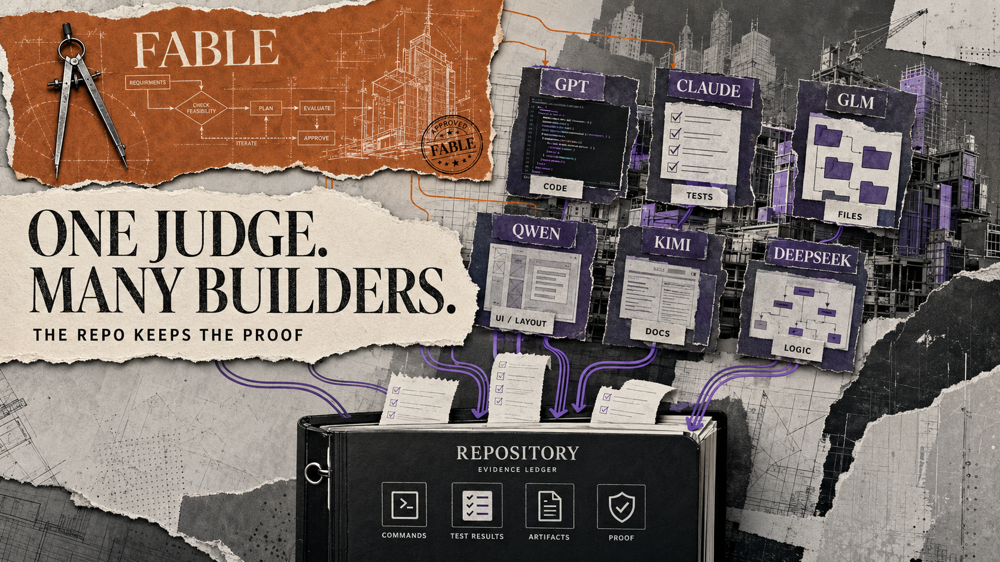
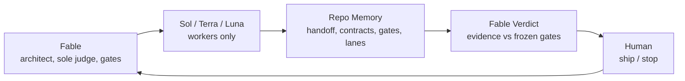
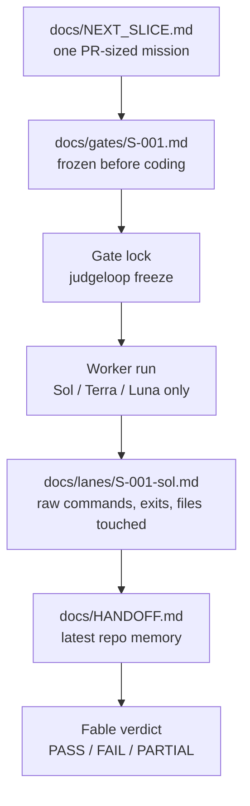

# JudgeLoop



> **Fable always judges. Sol, Terra, and Luna build. Repo stores proof. Human ships.**

JudgeLoop is a repo-local evidence protocol for AI-built software.

It keeps judgment separate from execution.

Fable architects and judges.
Sol, Terra, and Luna build, test, and report evidence.
Repo stores proof.
Human decides whether to ship.

Fable is the sole JudgeLoop verdict authority. Sol, Terra, and Luna are fixed
worker roles: they implement, verify, and return raw evidence, but never issue a
PASS or FAIL verdict.

The engine behind each worker is configurable and recorded in its lane report.
Changing the engine never changes the role: Fable judges; workers work.

| Agent | Fixed role | Can issue the JudgeLoop verdict? |
| --- | --- | --- |
| Fable | Architect and judge | Yes |
| Sol | Worker | No |
| Terra | Worker | No |
| Luna | Worker | No |

Freeze the gates before coding. Make every worker report raw evidence.

[](https://github.com/jumperz11/judge-loop)
[](https://github.com/jumperz11/judge-loop/actions/workflows/validate.yml)
[](LICENSE)

This is what a judged slice looks like. Real output from
[examples/demo-run/review-verdict.md](examples/demo-run/review-verdict.md):

VERDICT: PASS

RAW EVIDENCE REVIEWED
- node --test: 3 passed, 0 failed, exit 0.
- Diff touches only src/server.js (no change to /).
- Reviewer lane returned APPROVE.

GATE RESULTS
G-001  /health returns 200          PASS
G-002  body matches frozen shape    PASS
G-003  / unchanged                  PASS

KILL / CONTINUE: Continue.
NEXT SLICE: S-002 - assert content-type: application/json on /health.

No "looks good." Commands, exit codes, and frozen gates. The rest of this
README explains how to get that verdict on your own repo.



The point is simple: do not spend frontier-model time on typing. Spend it on
deciding what deserves to be typed.

---

## 30-Second Version

```bash
git clone https://github.com/jumperz11/judge-loop
cd judge-loop
export PATH="$PWD/bin:$PATH"
cd /path/to/your-project
judgeloop init .
# Fable fills NEXT_SLICE and docs/gates/<slice>.md
judgeloop freeze .
judgeloop doctor .
```

Fallback: `python3 /path/to/judge-loop/scripts/init.py .` and `python3 /path/to/judge-loop/scripts/doctor.py .`

## Install The CLI

From your `judge-loop` checkout:

```bash
export PATH="$PWD/bin:$PATH"
```

Then `judgeloop init .`, `freeze`, `verify`, and `doctor` work from your shell.

Then:

1. Paste [`prompts/01-architect-checkpoint.md`](prompts/01-architect-checkpoint.md) into Fable.
2. Run `judgeloop freeze .`, then `judgeloop doctor .` before dispatch.
3. Give the returned block to Sol, Terra, or Luna and record the model powering that worker.
4. The worker runs `judgeloop verify .` and writes evidence to `docs/HANDOFF.md` and `docs/lanes/`.
5. Paste [`prompts/03-architect-review.md`](prompts/03-architect-review.md) into Fable.
6. Fable alone writes `docs/verdicts/<slice>.md`, judges the evidence, and freezes the next slice.

That is the loop.

---

## Status

Usable manual JudgeLoop kit with fixed roles, tracked gate locks, adversarial
checks, and Fable verdict receipts.

This is intentionally small: repo memory, prompts, stricter doctor checks, an
installable skill, a tiny CLI wrapper, and a runnable demo. Headless automation
is optional and still adapter-specific.

---

## Why Use This

Fable is the architect and sole judge: judgment, planning, arbitration, and
long-horizon review. Sol, Terra, and Luna are workers only. Their engines can be
chosen per task without promoting a worker into a judge.

This loop separates those jobs.

| Bad default | Better loop |
| --- | --- |
| One model plans, codes, and grades itself. | Fable judges. Sol, Terra, and Luna build. |
| Success criteria move after seeing results. | Gates freeze before coding. |
| Context lives in chat scrollback. | State lives in `docs/`. |
| A worker says "looks good." | The repo stores raw commands and exit codes. |
| Expensive model types for hours. | Expensive model checks high-leverage decisions. |

Use this when a task is big enough to deserve a PR-sized slice, explicit gates,
and a real handoff.

Skip it for tiny edits.

## When Not To Use This

Do not use JudgeLoop for:

- one-line edits
- throwaway prototypes
- tasks where tests do not matter
- solo vibe coding where speed matters more than auditability

Use it when:

- the task is PR-sized
- correctness matters
- multiple models are involved
- you need evidence, not vibes

---

## What JudgeLoop Checks



The checks are intentionally boring:

| Artifact | What it prevents |
| --- | --- |
| `docs/gates/<slice>.md` | Moving success criteria after results exist. |
| `docs/gates/<slice>.sha256` | Silent edits after Fable freezes the gate. |
| `docs/lanes/<slice>-<worker>.md` | Worker claims without raw evidence. |
| `docs/HANDOFF.md` | Losing project state in chat history. |
| `docs/verdicts/<slice>.md` | Missing or anonymous final judgment. |
| `scripts/doctor.py` | Missing roles, slice drift, worker verdicts, and broken locks. |

---

## First Run

### 1. Clone

```bash
git clone https://github.com/jumperz11/judge-loop
cd judge-loop
```

### 2. Install the CLI for this shell

```bash
export PATH="$PWD/bin:$PATH"
```

### 3. Optional: install the Codex skill

```bash
./install.sh
```

Windows:

```powershell
.\install.ps1
```

Existing skill folders are backed up automatically. Use `--force` or `-Force`
only when you want to replace without a backup.

### 4. Add loop memory to your project

From inside the project you want to work on:

```bash
judgeloop init .
```

Fallback: `python3 /path/to/judge-loop/scripts/init.py .`

This creates:

```txt
docs/HANDOFF.md
docs/CONTRACTS.md
docs/DECISIONS.md
docs/EVALS.md
docs/NEXT_SLICE.md
docs/gates/
docs/lanes/
docs/verdicts/
docs/prd/
docs/research/
```

### 5. Write one small slice and gate file

Edit the next objective:

```txt
docs/NEXT_SLICE.md
```

Example:

```txt
Add GET /health returning:
{"status":"ok","uptime_s":<integer>}

Out of scope:
- auth
- metrics
- deployment
```

Then freeze the acceptance criteria in:

```txt
docs/gates/<slice>.md
```

Lock the gate before any worker starts:

```bash
judgeloop freeze .
```

This creates `docs/gates/<slice>.sha256`. Gate or lock edits make verification
fail until Fable explicitly reviews and re-freezes the revision.

Freshly initialized repos are expected to be `NOT READY` until placeholders are
filled, a gate file exists, and the required evidence docs are no longer blank.

### 6. Check readiness

```bash
judgeloop doctor .
```

Fallback: `python3 /path/to/judge-loop/scripts/doctor.py .`

If it says `READY`, start the loop.

---

## The Loop

### Step A: Fable plans

Paste this into Fable:

```txt
prompts/01-architect-checkpoint.md
```

Fable reads the repo docs, writes the slice and gate, calls out risks, runs
`judgeloop freeze .`, and ends with paste-ready worker blocks.

### Step B: Sol, Terra, or Luna builds

Give Fable's block to one or more workers. Any capable implementation model can
power a worker without changing its role.

Every worker must:

- disagree before coding
- cite real repo files
- verify APIs, schemas, commands, and formats
- run `judgeloop verify .` before implementation
- never edit gate files or `.sha256` locks
- build the slice
- run tests
- write raw evidence to `docs/HANDOFF.md` and `docs/lanes/`
- record Worker and Engine, then end with an allowed `STATUS`
- never issue a protocol verdict

### Step C: Fable reviews

After the workers finish, paste this into Fable:

```txt
prompts/03-architect-review.md
```

Give Fable the raw results:

- `docs/HANDOFF.md`
- `docs/gates/<slice>.md`
- `docs/gates/<slice>.sha256`
- `docs/lanes/<slice>-*.md`
- test output
- git diff summary

Fable returns:

```txt
PASS / FAIL / PARTIAL
```

Then Fable writes `docs/verdicts/<slice>.md`, updates HANDOFF, and freezes the
next slice. The human chooses whether to ship or stop.

Repeat.

---

## Runnable Demo

The demo is a tiny Node HTTP service called `pingbox`.

```bash
cd examples/demo-run/repo
npm test
```

It includes real source and tests:

```txt
examples/demo-run/repo/
|-- package.json
|-- src/server.js
|-- test/server.test.js
`-- docs/
    |-- gates/S-001.md
    |-- gates/S-002.md
    |-- gates/S-002.sha256
    |-- lanes/S-001-sol.md
    `-- verdicts/S-002.md
```

Validate the demo memory:

```bash
cd /path/to/judge-loop
python3 scripts/doctor.py examples/demo-run/repo
```

---

## The Core Files

| File | Purpose |
| --- | --- |
| [`prompts/01-architect-checkpoint.md`](prompts/01-architect-checkpoint.md) | Start a Fable architect checkpoint. |
| [`prompts/02-builder-contract.md`](prompts/02-builder-contract.md) | Fixed worker contract; the active engine is recorded per lane. |
| [`prompts/03-architect-review.md`](prompts/03-architect-review.md) | Review worker evidence with Fable. |
| [`prompts/04-headless-dispatch.md`](prompts/04-headless-dispatch.md) | Optional `codex exec` / worktree adapter. |
| [`prompts/05-research-checkpoint.md`](prompts/05-research-checkpoint.md) | Optional research checkpoint. |
| [`docs/BUILDERS.md`](docs/BUILDERS.md) | How worker engines vary without changing fixed roles. |
| [`docs/HANDOFF.md`](docs/HANDOFF.md) | Raw state after every work block. |
| [`docs/CONTRACTS.md`](docs/CONTRACTS.md) | Frozen APIs, schemas, interfaces, commands. |
| [`docs/EVALS.md`](docs/EVALS.md) | Scoreboard for success gates. |
| [`docs/gates/`](docs/gates/) | Per-slice gates and tracked SHA-256 locks. |
| [`docs/lanes/`](docs/lanes/) | Sol, Terra, and Luna evidence reports. |
| [`docs/verdicts/`](docs/verdicts/) | Fable-only PASS / FAIL / PARTIAL receipts. |
| [`docs/lanes/SCHEMA.md`](docs/lanes/SCHEMA.md) | Minimal lane-report schema and status values. |
| [`scripts/gates.py`](scripts/gates.py) | Freeze and verify gate locks. |
| [`bin/judgeloop`](bin/judgeloop) | Wrapper for `init`, `freeze`, `verify`, and `doctor`. |

If it is not in repo docs, it did not happen.

---

## Manual vs Headless

Most people should start with **manual mode**.

| Mode | Use when | How |
| --- | --- | --- |
| Manual | You want to watch the run and paste between Fable and workers. | Fable -> freeze -> workers -> Fable verdict. |
| Headless | The slice is big enough for unattended or parallel lanes. | Fable writes `.architect/` dispatch blocks; `codex exec` runs per lane. |

Manual mode is the product. Headless mode is the Codex adapter.

---

## The Rules

1. Fable is the sole architect and judge.
2. Sol, Terra, and Luna are workers only: building, testing, and evidence.
3. Repo docs are memory.
4. Workers never grade their own work or issue PASS / FAIL / PARTIAL verdicts.
5. Disagreement is mandatory.
6. Gates freeze before results exist.
7. Every gate has a tracked SHA-256 lock; worker edits to either file fail the slice.
8. Parallel lanes need disjoint file ownership.
9. If Fable is down or expensive, workers continue only from frozen specs, record unresolved decisions, and wait for Fable to issue the next verdict.

That last rule matters. If the workflow dies when Fable is unavailable, you
built a dependency, not leverage.

---

## Validate The Kit

Inside this repo:

```bash
make validate
```

This checks:

- demo repo memory
- demo source tests
- fixed-role and adversarial regression tests
- gate-lock integrity
- Python scripts
- skill metadata
- markdown links
- code fences

---

## What Is Included

```txt
judge-loop/
|-- README.md
|-- Makefile
|-- bin/judgeloop
|-- install.sh
|-- install.ps1
|-- docs/
|-- prompts/
|-- scripts/
|-- skills/judge-loop/
|-- examples/demo-run/
|-- templates/
`-- tests/
```

See the worked example:

```txt
examples/demo-run/
```

See what was borrowed and what stayed intentionally simpler:

```txt
docs/REFERENCE_GAPS.md
```

See how to swap worker engines:

```txt
docs/BUILDERS.md
```

---

## FAQ

**Do I need API keys?**

No by default. The intended flow uses subscriptions. The headless mode can use
`codex exec` if you have the Codex CLI set up.

**Do I need two different models?**

Not necessarily. Worker engines can vary, but the named roles cannot: Fable is
always the judge; Sol, Terra, and Luna are always workers.

**Can I use Opus, GLM, Kimi, DeepSeek, Qwen, or another LLM instead of Codex?**

Yes. JudgeLoop does not require a default worker model. Any capable LLM can
power Sol, Terra, or Luna if it follows the worker contract: disagree first,
touch only declared files, run checks, and write raw evidence to
`docs/HANDOFF.md` / `docs/lanes/`. It remains a worker and cannot issue verdicts.

**Why not let Fable code too?**

Because JudgeLoop keeps the boundary hard. Fable handles scope, architecture,
arbitration, evidence review, and verdicts. Sol, Terra, and Luna handle the work.

**What if Fable is limited, down, or expensive?**

Workers continue only from frozen specs. Any strategic decision or unresolved
disagreement goes to `docs/HANDOFF.md`. No new verdict is issued until Fable
returns.

**Is this tied to one language or framework?**

No. It is just repo memory, frozen gates, and role separation.

---

## License

MIT. Share it, remix it, ship with it.
